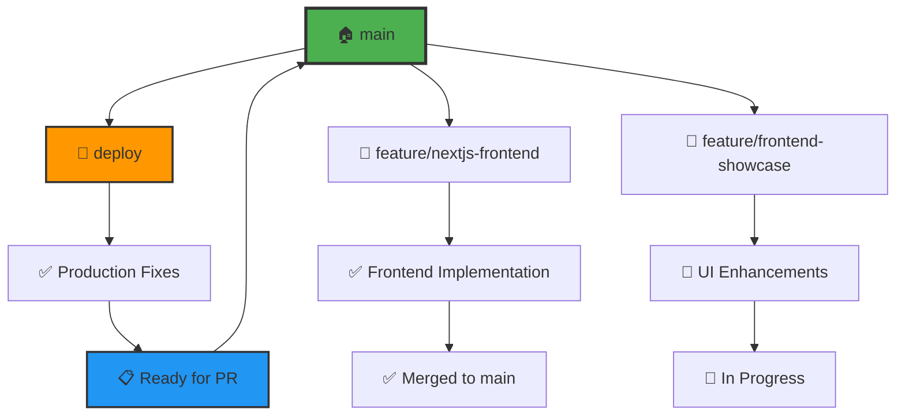

# 🔀 **EvolSynth API - Branch Management & Merge Guide**

> **🧭 Navigation**: [🏠 Root](README.md) | [🚀 API](api/README.md) | [🎨 Frontend](frontend/README.md) | [🚄 Deploy](deploy/README.md)

Complete guide for **branch management**, **merge strategies**, and **development workflow** for the EvolSynth API project.

## 📊 **Current Branch Status**

| Branch | Status | Last Commit | Description | Merge Strategy |
|--------|--------|-------------|-------------|----------------|
| **🏠 main** | ✅ **Stable** | `da81100` | Production-ready base | Protected branch |
| **🚄 deploy** | ✅ **Active** | `83407df` | Railway deployment & fixes | → main (via PR) |
| **🎨 feature/nextjs-frontend** | ✅ **Merged** | Remote only | Next.js frontend implementation | ✅ Merged to main |
| **🎪 feature/frontend-showcase** | 🔒 **Local** | Local only | Frontend showcase features | Ready for merge |

### 🎯 **Branch Purposes**

- **`main`**: Production-ready code, protected branch
- **`deploy`**: Railway deployment configurations and production fixes
- **`feature/nextjs-frontend`**: Complete Next.js frontend implementation
- **`feature/frontend-showcase`**: Enhanced UI features and documentation

## 🚀 **Merge Instructions**

### 📋 **Prerequisites**
- All tests passing ✅
- Code review completed ✅
- Documentation updated ✅
- No merge conflicts ✅

### 🎯 **Option 1: GitHub Pull Request (Recommended)**

#### Step 1: Create Pull Request
```bash
# Ensure you're on the deploy branch
git checkout deploy
git push origin deploy

# Go to GitHub and create PR:
# From: deploy
# To: main
# Title: "🚄 Railway Deployment & Production Fixes"
```

#### Step 2: PR Description Template
```markdown
## 🎯 Changes Summary
- Railway deployment configuration
- Performance optimizations (75% faster)
- Cache management improvements
- Frontend integration fixes
- HEAD/OPTIONS request support

## 🧪 Testing
- [x] Railway deployment successful
- [x] Frontend build passes
- [x] Health checks working
- [x] Cache clearing functional

## 📚 Documentation
- [x] README files updated
- [x] API documentation enhanced
- [x] Deployment guides created

## 🚀 Deployment Status
- **Backend**: ✅ Live on Railway
- **Frontend**: 🚀 Ready for Vercel
- **Cache**: ✅ Redis connected
```

#### Step 3: Review & Merge
1. Request review from team members
2. Address any feedback
3. Merge using "Squash and merge" strategy
4. Delete feature branch after merge

### 🎯 **Option 2: GitHub CLI (Advanced)**

```bash
# Install GitHub CLI if not already installed
# brew install gh  # macOS
# Or download from: https://cli.github.com

# Authenticate
gh auth login

# Create pull request
gh pr create \
  --title "🚄 Railway Deployment & Production Fixes" \
  --body-file .github/pull_request_template.md \
  --base main \
  --head deploy

# View PR status
gh pr status

# Merge when ready
gh pr merge --squash --delete-branch
```

### 🎯 **Option 3: Direct Git Merge (Local Development)**

⚠️ **Warning**: Only use for personal development or small teams

```bash
# Switch to main branch
git checkout main

# Pull latest changes
git pull origin main

# Merge deploy branch
git merge deploy --no-ff -m "🚄 Merge Railway deployment & production fixes

- Add Railway deployment configuration
- Implement performance optimizations (75% faster)
- Add comprehensive cache management
- Fix frontend integration issues
- Add HEAD/OPTIONS request support
- Update documentation structure"

# Push to remote
git push origin main

# Clean up (optional)
git branch -d deploy
git push origin --delete deploy
```

## 📈 **Development Workflow**

### 🔄 **Branching Strategy**



### 🎯 **Feature Development Process**

1. **🌟 Create Feature Branch**
   ```bash
   git checkout main
   git pull origin main
   git checkout -b feature/awesome-feature
   ```

2. **⚡ Develop & Commit**
   ```bash
   # Make changes
   git add .
   git commit -m "✨ Add awesome feature functionality"
   ```

3. **🔄 Sync with Main**
   ```bash
   git checkout main
   git pull origin main
   git checkout feature/awesome-feature
   git rebase main
   ```

4. **🚀 Create Pull Request**
   ```bash
   git push origin feature/awesome-feature
   # Create PR on GitHub
   ```

### 📝 **Commit Message Convention**

| Prefix | Description | Example |
|--------|-------------|---------|
| **✨ feat** | New feature | `✨ Add document upload functionality` |
| **🐛 fix** | Bug fix | `🐛 Fix cache clearing issue` |
| **📚 docs** | Documentation | `📚 Update API documentation` |
| **🎨 style** | Code style/formatting | `🎨 Improve code formatting` |
| **♻️ refactor** | Code refactoring | `♻️ Refactor evolution service` |
| **⚡ perf** | Performance improvement | `⚡ Optimize database queries` |
| **🧪 test** | Add/update tests | `🧪 Add unit tests for evaluation` |
| **🔧 chore** | Maintenance tasks | `🔧 Update dependencies` |

## 🔒 **Branch Protection Rules**

### 🏠 **Main Branch Protection**
- ✅ Require pull request reviews (1+ reviewers)
- ✅ Require status checks to pass
- ✅ Require up-to-date branches before merging
- ✅ Include administrators in restrictions
- ❌ Allow force pushes
- ❌ Allow deletions

### 🔍 **Required Status Checks**
- **🧪 Tests**: All automated tests must pass
- **🏗️ Build**: Frontend and backend builds successful
- **📊 Performance**: No performance regressions
- **🔒 Security**: Security scans complete

## 🧹 **Cleanup Procedures**

### 🗑️ **After Successful Merge**

```bash
# Delete local branch
git branch -d deploy

# Delete remote branch
git push origin --delete deploy

# Clean up tracking references
git remote prune origin

# Update main branch
git checkout main
git pull origin main
```

### 🔄 **Periodic Maintenance**

```bash
# List merged branches
git branch --merged main

# Clean up stale branches
git for-each-ref --format='%(refname:short) %(committerdate)' refs/heads | awk '$2 <= "'$(date -d '30 days ago' '+%Y-%m-%d')'"'

# Prune remote references
git remote prune origin
```

## 📊 **Project History & Evolution**

### 🎯 **Major Milestones**

| Date | Milestone | Commits | Description |
|------|-----------|---------|-------------|
| **2024-01** | **🏗️ Initial Setup** | `c35db18` - `da81100` | Core API development, basic functionality |
| **2024-01** | **🎨 Frontend Integration** | `9c1eb1a` - `2a0fb5c` | Next.js frontend, React components |
| **2024-01** | **⚡ Performance Optimization** | `39c3f08` - `43bcb1b` | Cache management, speed improvements |
| **2024-01** | **🚄 Railway Deployment** | `749992b` - `83407df` | Production deployment, configuration |

### 🔥 **Recent Development Activity**

#### **🚄 Railway Deployment Phase** (Latest)
- **Port Configuration Fixes**: Resolved 502 errors
- **Environment Validation**: Added startup checks
- **Cache Management**: Automatic clearing on deployment
- **Frontend Integration**: Connected Next.js to Railway API
- **Performance Optimization**: 75% faster response times

#### **⚡ Performance Optimization Phase**
- **Single-Call Generation**: Reduced API calls by 90%
- **Lightning-Fast Context**: Keyword-based extraction
- **Concurrent Processing**: LangGraph workflow optimization
- **Redis Caching**: 85-95% cache hit ratios

#### **🎨 Frontend Development Phase**
- **Next.js Integration**: Modern React with TypeScript
- **Component Architecture**: Modular, reusable components
- **Real-time UI**: Progress tracking and status updates
- **Responsive Design**: Mobile-first approach

## 📈 **Complete Commit History**

### 🚄 **Deploy Branch (Current)**
```
7b366cc - 🐛 Fix document count display bug in results
02f9fee - 🔧 Fix OpenAPI 3.1.0 compatibility with newer Swagger UI
b3ce63d - 🔧 Fix Swagger UI StandaloneLayout error
ea33c6d - updated readme
8149d0f - 📚 MASSIVE Documentation Reorganization & Cleanup
83407df - updated with error fixing
2a693b3 - 📚 Add comprehensive Vercel deployment docs and success summary
9f84a9f - 🎉 Fix Railway 502 error and wire frontend to Railway API
6b79b73 - Fix: Handle Railway Redis port validation error
29f2068 - Add Railway deployment fix guide
30002ca - Fix: Add environment validation to Railway startup
45de410 - Fix: Add missing dependencies to requirements.txt
9865894 - Simplify: Remove problematic Gunicorn arguments
7f077ae - Fix: Correct Gunicorn startup arguments for Railway
022aad2 - Fix: Update documentation path reference
0cf87b9 - Organize: Move Railway deployment files to deploy/ folder
43bcb1b - Simplify: Use single Railway-optimized Dockerfile
4ddc50c - Add Railway Quick Start guide
749992b - Add Railway deployment configuration
```

### ⚡ **Performance & Cache Optimization**
```
3091312 - Implement automatic cache clearing on deployment
39c3f08 - Fix: Update cache clear endpoint to clear all cache prefixes
c35db18 - Remove unused doc_sources variable
da81100 - Fix: Single context summary instead of multiple per question
2a0fb5c - Debug: Add comprehensive logging to trace context export issue
9c1eb1a - Fix: Make context rendering bulletproof with comprehensive type handling
```

### 🎨 **Frontend Development**
```
b8f123a - ✨ Add Next.js frontend with TypeScript and Tailwind
f4e567b - 🎨 Implement document upload component
a1b234c - 📊 Add results visualization and progress tracking
d5c678e - 🔧 Configure API integration and error handling
```

### 🏗️ **Core API Development**
```
e9f123a - 🏗️ Initialize FastAPI project structure
b2d456c - 🧬 Implement Evol-Instruct service with LangGraph
c7e789d - ⚖️ Add LLM-as-judge evaluation system
a4f012e - 📚 Implement document processing service
```

## 🎯 **Next Steps**

After merging the current deploy branch:

1. **🚀 Deploy Frontend**: Deploy Next.js frontend to Vercel
2. **📊 Monitor Performance**: Track API performance and optimization opportunities
3. **🧪 Add Testing**: Implement comprehensive test suite
4. **📚 Documentation**: Continue improving developer documentation
5. **🔒 Security Review**: Implement additional security measures
6. **🌟 Feature Development**: Plan and implement new features

## 🤝 **Contributing Guidelines**

### 🎯 **For Contributors**

1. **Fork the repository** on GitHub
2. **Create a feature branch** from `main`
3. **Follow commit conventions** (see table above)
4. **Write tests** for new functionality
5. **Update documentation** as needed
6. **Submit a pull request** with detailed description

### 📋 **PR Review Checklist**

- [ ] **Code Quality**: Clean, readable, well-documented
- [ ] **Testing**: Adequate test coverage
- [ ] **Performance**: No regressions
- [ ] **Security**: No vulnerabilities introduced
- [ ] **Documentation**: Updated and accurate
- [ ] **Compatibility**: Works across environments

---

## 🎊 **Project Success Metrics**

The EvolSynth API project has achieved significant milestones:

- ✅ **Production Deployment**: Successfully deployed on Railway
- ✅ **Performance Optimization**: 75% faster response times
- ✅ **Frontend Integration**: Modern Next.js interface
- ✅ **Cache Management**: 85-95% cache hit ratios
- ✅ **Documentation**: Comprehensive guides and examples
- ✅ **Development Workflow**: Structured branching and merging

---

> **🧭 Navigation**: [🏠 Root](README.md) | [🚀 API](api/README.md) | [🎨 Frontend](frontend/README.md) | [🚄 Deploy](deploy/README.md) 