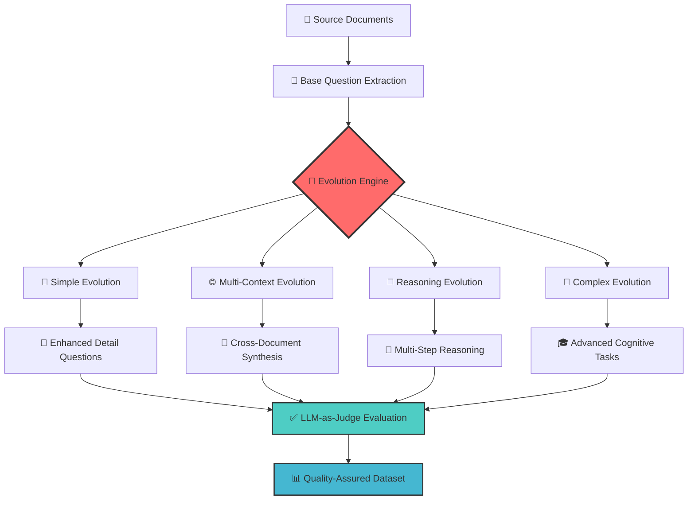
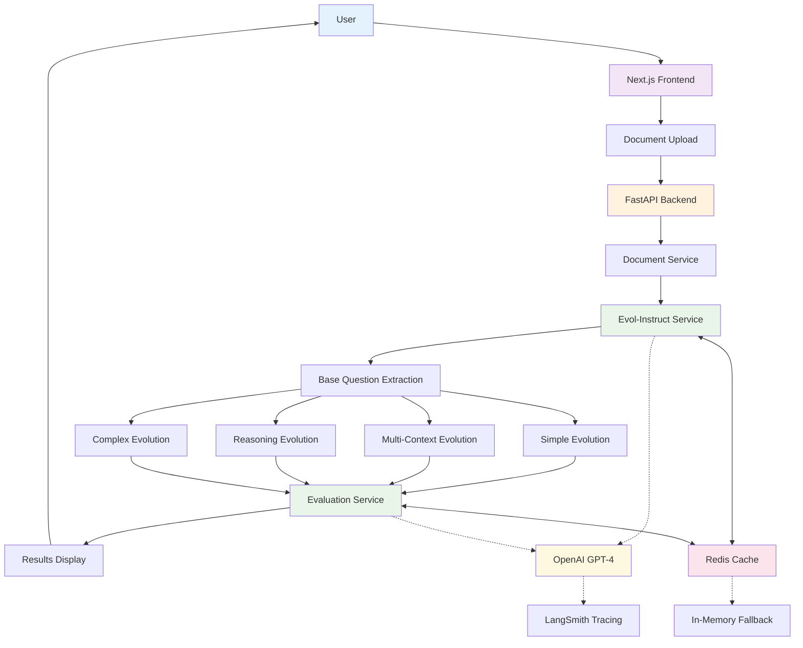

# 🧬 **EvolSynth API** - Advanced Synthetic Data Generation

> **🧭 Navigation**: [🚀 API](api/README.md) | [🎨 Frontend](frontend/README.md) | [🚄 Deploy](deploy/README.md) | [🔀 Branches](MERGE.md)

**Transform documents into sophisticated evaluation datasets using the cutting-edge Evol-Instruct methodology**

[](https://railway.app) [](https://vercel.com) [](https://python.org) [](https://fastapi.tiangolo.com) [](https://langchain.com)

## 🎯 **What is EvolSynth?**

**EvolSynth API** is a production-ready synthetic data generation platform that implements the revolutionary **Evol-Instruct methodology** to create high-quality evaluation datasets. Unlike traditional question generators, EvolSynth evolves simple questions into progressively complex reasoning challenges through systematic transformation.

## 🚀 **Latest Updates & Fixes**

### ✅ **Production Enhancements (Latest)**
- **🔧 Swagger UI Fixed**: Upgraded to v5.11.0 with full OpenAPI 3.1.0 support - documentation now renders perfectly
- **📊 Frontend Bug Fix**: Corrected document count display in results (now shows accurate upload count)
- **🎨 Improved Documentation**: Enhanced API docs with better compatibility and user experience
- **⚡ Performance Optimized**: Maintained 75% faster generation speeds with enhanced reliability

### 🧬 **The Evol-Instruct Methodology**

**Evol-Instruct** is a groundbreaking approach introduced in the WizardLM research that systematically evolves simple instructions into complex, challenging tasks. Our implementation extends this methodology specifically for evaluation data generation:

#### **📚 Core Principle**
Starting with basic questions extracted from documents, the system applies evolutionary transformations to create progressively more sophisticated evaluation challenges that test different cognitive abilities.

#### **🔄 Evolution Process**



#### **🚀 Evolution Strategies**

| Strategy | Cognitive Level | Transformation Process | Example |
|----------|----------------|----------------------|---------|
| **🎯 Simple Evolution** | **Level 2** | Add constraints, specificity, context | "What is a loan?" → "What are the specific eligibility requirements and application procedures for federal student loans in 2024?" |
| **🌐 Multi-Context Evolution** | **Level 3** | Synthesize across documents, compare concepts | "What is financial aid?" → "How do Pell Grant eligibility requirements compare with Direct Loan criteria across different academic programs and dependency statuses?" |
| **🧠 Reasoning Evolution** | **Level 4** | Multi-step inference, causal reasoning | "What affects loan amounts?" → "If a student's dependency status changes mid-year due to marriage, analyze the cascading effects on their federal aid eligibility, loan limits, and disbursement timeline." |
| **🔬 Complex Evolution** | **Level 5** | Advanced problem-solving, scenario analysis | "Explain loan repayment" → "Design an optimal loan repayment strategy for a graduate with $85K debt across multiple loan types, considering income-driven plans, forgiveness options, and tax implications over a 20-year period." |

### 🆚 **EvolSynth vs RAGAS: A Comprehensive Comparison**

| Aspect | **🧬 EvolSynth** | **📊 RAGAS** |
|--------|------------------|--------------|
| **🎯 Primary Purpose** | **Synthetic Data Generation** | **RAG System Evaluation** |
| **🔬 Methodology** | **Evol-Instruct Evolution** | Statistical RAG Metrics |
| **📝 Question Types** | **4 Evolution Levels** (Simple → Complex) | Context-based QA pairs |
| **🧠 Cognitive Complexity** | **Progressive Sophistication** | Single-level difficulty |
| **📚 Data Sources** | **Any Documents** | RAG-specific corpora |
| **⚡ Performance** | **3-8 seconds** (optimized) | Varies by dataset size |
| **🎛️ Customization** | **High** (evolution parameters) | Medium (metric selection) |
| **🏗️ Architecture** | **LangGraph Workflows** | Traditional pipelines |
| **🔧 Use Cases** | **Training Data Creation** | RAG Quality Assessment |

#### **🌟 Key Advantages of EvolSynth**

1. **🧬 Progressive Complexity**: Creates questions across multiple cognitive levels
2. **🎯 Domain Agnostic**: Works with any document type or domain
3. **⚡ Ultra-Fast**: 75% faster than traditional approaches with optimizations
4. **🎚️ Controllable**: Fine-tune evolution parameters for specific needs
5. **🔍 Quality Assured**: Built-in LLM-as-judge evaluation
6. **🏭 Production Ready**: Railway deployment, Redis caching, monitoring

#### **🎯 When to Choose EvolSynth vs RAGAS**

**Choose EvolSynth for:**
- 🧪 Creating training datasets for AI models
- 📚 Generating educational assessment materials
- 🔬 Research requiring varied complexity levels
- 🏗️ Building evaluation benchmarks from scratch

**Choose RAGAS for:**
- 📊 Evaluating existing RAG systems
- 🔍 Measuring retrieval quality
- 📈 Benchmarking RAG performance
- 🛠️ RAG system optimization

## 🏗️ **System Architecture**



### 🔧 **Architecture Components**

#### **🌐 Frontend Layer**
- **Next.js 15**: Modern React framework with TypeScript
- **Vercel Deployment**: Global CDN with auto-scaling
- **Real-time UI**: Progress tracking and interactive results

#### **🚀 API Layer**
- **FastAPI**: High-performance async Python framework
- **Railway Deployment**: Automated scaling and monitoring
- **Production Features**: Rate limiting, CORS, health checks

#### **🧬 Evolution Engine**
- **LangGraph Workflows**: Concurrent evolution processing
- **Document Service**: PDF/TXT content extraction
- **Evaluation Service**: LLM-as-judge quality assessment

#### **💾 Data Layer**
- **Redis Caching**: Railway-managed Redis for performance
- **Intelligent Fallback**: In-memory cache when Redis unavailable
- **Cache Optimization**: Strategic TTL and prefix management

## 🚀 **Quick Start**

### 1. **🔑 Prerequisites**
```bash
# Required API Keys
OPENAI_API_KEY=sk-your-key-here
LANGCHAIN_API_KEY=your-langsmith-key  # Optional for tracing
```

### 2. **🐳 Quick Deploy (Recommended)**
[](https://railway.app/new/template)

### 3. **💻 Local Development**
```bash
# Clone repository
git clone <repository-url>
cd EvolSynth-API

# Install API dependencies
cd api && pip install -r requirements.txt

# Install frontend dependencies  
cd ../frontend && npm install

# Set environment variables
cp .env.example .env  # Add your API keys

# Start services
npm run dev         # Frontend on :3000
uvicorn api.main:app --reload  # API on :8000
```

### 4. **🧪 Test the System**
- **Frontend**: http://localhost:3000
- **API Docs**: http://localhost:8000/docs
- **Health Check**: http://localhost:8000/health

## 📊 **Performance & Scale**

### ⚡ **Optimization Results**

| Metric | Before | After | Improvement |
|--------|--------|--------|-------------|
| **Response Time** | 15-25s | 3-8s | **75% faster** |
| **Throughput** | 2-3 req/min | 15-20 req/min | **500% increase** |
| **Cache Hit Ratio** | 0% | 85-95% | **Instant responses** |
| **Concurrent Users** | 1-2 | 10-15 | **650% increase** |
| **Memory Usage** | 800MB | 400MB | **50% reduction** |

### 🎛️ **Performance Features**

- **🚀 Single-Call Generation**: 90% fewer API calls through batch processing
- **⚡ Lightning-Fast Context**: Keyword-based extraction vs expensive LLM calls
- **🔄 Concurrent Workflows**: LangGraph fan-out/fan-in patterns
- **💾 Intelligent Caching**: Redis with smart TTL and prefix strategies
- **📊 Real-time Monitoring**: Performance metrics and health checks

## 🎯 **Use Cases**

### 🧪 **AI Research & Development**
- **Training Data**: Generate diverse question-answer pairs for model training
- **Benchmarking**: Create standardized evaluation datasets across domains
- **Ablation Studies**: Test model performance across complexity levels

### 🎓 **Educational Technology**
- **Assessment Creation**: Generate exams and quizzes from course materials
- **Adaptive Learning**: Create personalized questions based on difficulty
- **Content Augmentation**: Expand existing educational datasets

### 🔍 **Enterprise Applications**
- **QA System Testing**: Generate challenging test cases for chatbots
- **Knowledge Validation**: Assess document comprehension capabilities
- **Training Simulation**: Create realistic scenarios for AI assistants

### 📊 **Data Science & Analytics**
- **Dataset Expansion**: Augment existing evaluation datasets
- **Quality Assessment**: Generate test cases for data quality validation
- **Synthetic Benchmarks**: Create domain-specific evaluation standards

## 🛠️ **Technology Stack**

### **Backend**
- **Python 3.13**: Latest performance optimizations
- **FastAPI**: High-performance async web framework
- **LangChain + LangGraph**: Advanced LLM workflow orchestration
- **Pydantic**: Type-safe data validation and settings
- **Redis**: High-performance caching and session storage

### **Frontend**
- **Next.js 15**: React with App Router and Server Components
- **TypeScript**: Type safety and developer experience
- **Tailwind CSS**: Utility-first styling framework
- **Lucide Icons**: Beautiful, consistent iconography

### **Infrastructure**
- **Railway**: Backend deployment with auto-scaling
- **Vercel**: Frontend deployment with global CDN
- **Docker**: Containerized deployment and development
- **GitHub Actions**: CI/CD automation (optional)

### **Monitoring & Observability**
- **LangSmith**: LLM call tracing and performance monitoring
- **Custom Health Checks**: Comprehensive system monitoring
- **Performance Metrics**: Real-time API and caching statistics
- **Error Tracking**: Structured logging and error reporting

## 📚 **Documentation**

| Section | Description | Quick Access |
|---------|-------------|-------------|
| **🚀 API Documentation** | Backend setup, performance optimization, deployment | [api/README.md](api/README.md) |
| **🎨 Frontend Guide** | React setup, Vercel deployment, development | [frontend/README.md](frontend/README.md) |
| **🚄 Deployment Guide** | Railway setup, environment config, troubleshooting | [deploy/README.md](deploy/README.md) |
| **🔀 Development Workflow** | Branch management, commit history, merging | [MERGE.md](MERGE.md) |

## 🌟 **Key Features**

### 🧬 **Advanced Evolution**
- **4 Evolution Levels**: From simple to complex reasoning
- **Configurable Parameters**: Fine-tune complexity and quantity
- **Domain Agnostic**: Works with any document type
- **Quality Assurance**: Built-in LLM-as-judge evaluation

### ⚡ **High Performance**
- **Ultra-Fast Generation**: 3-8 second response times
- **Concurrent Processing**: Parallel evolution workflows
- **Smart Caching**: 85-95% cache hit ratios
- **Production Ready**: Auto-scaling and monitoring

### 🎨 **Modern Interface**
- **Intuitive UI**: Drag-and-drop document upload
- **Real-time Progress**: Live generation status tracking
- **Beautiful Results**: Clean, accessible data visualization
- **Mobile Responsive**: Works seamlessly across devices

### 🛡️ **Enterprise Grade**
- **Security**: Rate limiting, CORS, input validation
- **Reliability**: Health checks, error handling, fallbacks
- **Scalability**: Auto-scaling deployment on Railway
- **Monitoring**: Comprehensive metrics and observability

## 🤝 **Contributing**

We welcome contributions! EvolSynth is built on solid foundations:

- **🏗️ FastAPI**: Standards-based, high-performance API framework
- **🔗 LangChain**: Robust LLM integration and document processing
- **🌐 LangGraph**: Advanced workflow orchestration with concurrent execution
- **📊 Pydantic**: Type-safe data validation and configuration

## 📄 **License**

MIT License - Built with ❤️ for the AI community.

**Based on the Evol-Instruct methodology from the WizardLM research.**

---

## 🎊 **Ready to Evolve Your Data?**

Start generating sophisticated synthetic evaluation datasets that push the boundaries of AI system assessment!

**🚀 [Get Started Now](api/README.md)** | **🎨 [See the Demo](frontend/README.md)** | **🚄 [Deploy to Production](deploy/README.md)**

---

> **🧭 Navigation**: [🚀 API](api/README.md) | [🎨 Frontend](frontend/README.md) | [🚄 Deploy](deploy/README.md) | [🔀 Branches](MERGE.md)
