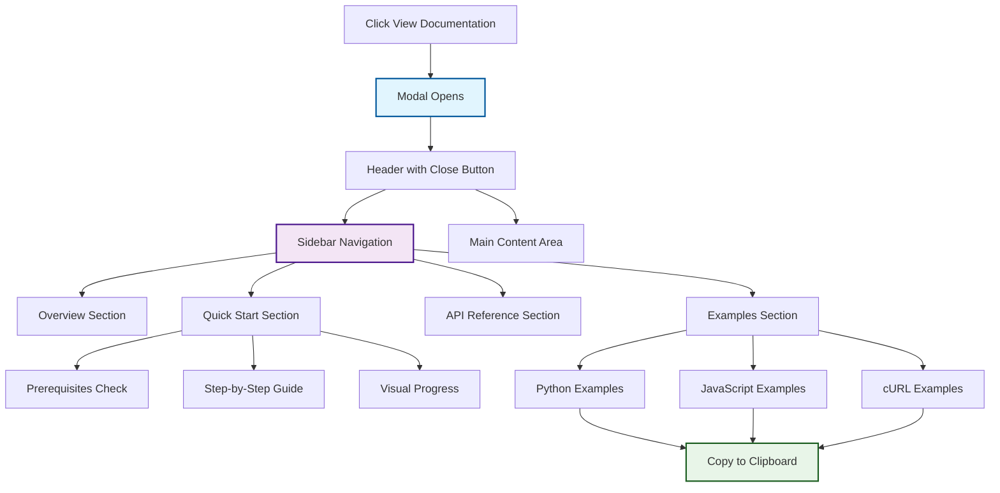

# EvolSynth-API 🚀

**Advanced Synthetic Data Generation using LangGraph-based Evol-Instruct methodology**

Transform your documents into sophisticated evaluation datasets with intelligent question evolution, concurrent processing, and comprehensive quality assessment.

## 🎯 What is EvolSynth?

EvolSynth implements the cutting-edge **Evol-Instruct methodology** using **LangGraph workflows** to generate high-quality synthetic evaluation data. Unlike simple question generators, EvolSynth creates progressively complex questions through three sophisticated evolution strategies:

### 🧠 Evolution Strategies

| Strategy | Complexity | Purpose | Example Transformation |
|----------|------------|---------|----------------------|
| **🎯 Simple Evolution** | Level 2 | Detail enhancement | "What is a loan?" → "What are the specific eligibility requirements and application procedures for federal student loans?" |
| **🌐 Multi-Context Evolution** | Level 3 | Cross-document synthesis | "What is financial aid?" → "How do Pell Grant eligibility requirements compare with Direct Loan criteria across different academic programs?" |
| **🧠 Reasoning Evolution** | Level 4 | Multi-step logical inference | "What affects loan amounts?" → "If a student's dependency status changes mid-year, how would this impact their loan eligibility and disbursement schedule?" |

## 🎨 Modal Documentation System

EvolSynth features a **comprehensive Modal Documentation system** that provides an integrated, user-friendly documentation experience directly within the application.

### 🏗️ Modal Documentation Architecture



### 🎯 Modal Documentation Features

#### **📱 Integrated Experience**
- **Rich Modal Interface**: Beautiful overlay with backdrop blur
- **Responsive Design**: Works seamlessly on all devices
- **Brand Consistency**: Matches application design language
- **No Redirects**: Stays within the application context

#### **🧭 Interactive Navigation**
- **4 Comprehensive Sections:**
  - 📖 **Overview**: Features, benefits, and evolution strategies
  - ⚡ **Quick Start**: Step-by-step setup with prerequisites
  - 🔧 **API Reference**: Complete endpoint documentation
  - 💻 **Examples**: Multi-language code samples

#### **📋 Developer-Friendly Features**
- **Copy-to-Clipboard**: One-click copying for all code examples
- **Multiple Languages**: Python, JavaScript, cURL examples
- **Visual Feedback**: Animated confirmations and progress indicators
- **Real Examples**: Ready-to-run code snippets

#### **🎨 Enhanced User Experience**
- **Visual Step Numbers**: Numbered progress indicators
- **Prerequisites Checklist**: Clear setup requirements
- **Expected Responses**: What to expect from each API call
- **Dual-Path Guidance**: Interface vs API usage options

### 💻 Code Examples Available

**Python Integration:**
```python
import requests

response = requests.post("http://localhost:8000/generate", json={
    "documents": [{"content": "...", "metadata": {...}}],
    "settings": {"execution_mode": "concurrent", ...}
})
```

**JavaScript/Node.js:**
```javascript
const response = await fetch('http://localhost:8000/generate', {
  method: 'POST',
  headers: { 'Content-Type': 'application/json' },
  body: JSON.stringify({...})
});
```

**cURL Commands:**
```bash
curl -X POST "http://localhost:8000/generate" \
  -H "Content-Type: application/json" \
  -d '{...}'
```

### 🔄 Documentation Options

The system provides **flexible documentation access**:

1. **Modal Documentation** (Default): Integrated experience within the app
2. **External Swagger Docs**: Full FastAPI documentation at `/docs`
3. **Easy Switching**: Toggle between modes with simple code changes

### 🎪 Benefits Over Traditional Documentation

| Feature | Modal Documentation | External Docs |
|---------|-------------------|---------------|
| **User Context** | ✅ Stays in app | ❌ Redirects away |
| **Design Consistency** | ✅ Matches brand | ❌ Generic styling |
| **Mobile Experience** | ✅ Optimized | ⚠️ Basic |
| **Learning Path** | ✅ Guided journey | ❌ Reference-focused |
| **Code Examples** | ✅ Multi-language | ✅ Auto-generated |
| **Copy-to-Clipboard** | ✅ Custom implementation | ⚠️ Limited |

## 🚀 Quick Start

### Prerequisites
- Backend running on `http://localhost:8000`
- OpenAI API key configured
- LangSmith API key for monitoring (optional)

### 1. Health Check
```bash
curl http://localhost:8000/health
```

### 2. Access Documentation
- **Frontend**: Click "View Documentation" button
- **API Docs**: Visit `http://localhost:8000/docs`

### 3. Generate Data
- Use the beautiful frontend interface
- Or make direct API calls programmatically

## 📊 Performance Features

- **🔄 Concurrent Execution**: 3x faster generation through LangGraph workflows
- **📈 Real-time Monitoring**: LangSmith integration for evaluation tracking
- **🎚️ Quality Control**: Built-in LLM-as-judge evaluation
- **🔧 Flexible Configuration**: Customizable evolution parameters

## 🛠️ Architecture

```
📁 EvolSynth-API/
├── 🎨 frontend/           # Next.js frontend with Modal Documentation
├── ⚙️ api/                # FastAPI backend with LangGraph workflows
├── 🧪 tests/              # Comprehensive test suite
└── 📚 docs/               # Additional documentation
```

## 📈 Quality Assessment

EvolSynth includes **comprehensive quality assessment** with:
- **Question Quality**: Clarity, specificity, educational value
- **Answer Accuracy**: Correctness and completeness
- **Evolution Effectiveness**: Cognitive complexity achievement
- **LangSmith Monitoring**: Real-time evaluation tracking

## 🤝 Contributing

We welcome contributions! The project is built with:
- **🏗️ FastAPI**: High-performance API framework
- **🔗 LangChain**: Robust LLM integration
- **🌐 LangGraph**: Advanced workflow orchestration
- **⚛️ Next.js**: Modern React frontend
- **📊 LangSmith**: Comprehensive monitoring

## 📄 License

Built with ❤️ for the AI community. Based on the Evol-Instruct methodology from WizardLM research.

---

**Ready to evolve your data?** 🚀 Start generating sophisticated synthetic evaluation datasets that push the boundaries of AI system assessment!
